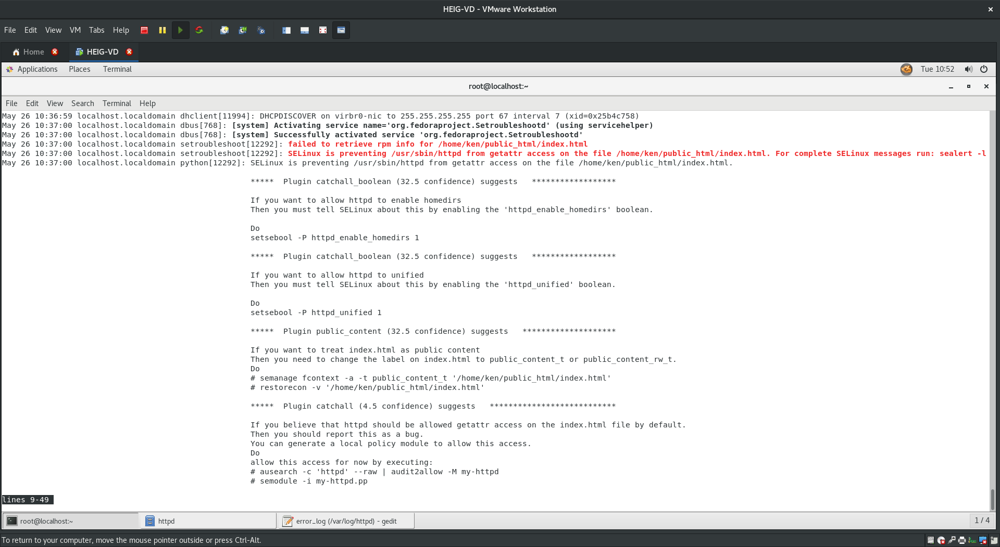

# SOS Linux
## LAB 1 - Questions

## Exercice rapide sur les permissions POSIX

- Trouvez les fichiers dont le compte 'root' est le propriétaire et qui snt 'readable', 'writable' et 'executable' par tout le monde dans le répertoire home

`find /home -user root -type f-perm -a+rwx 2>/dev/null`

- Trouvez tous les fichiers qui disposent des flags SUID et GUID

Pour SUID:
 
`find / -perm -4000 2>/dev/null` 

Pour GUID:

`find / -perm -6000 2>/dev/null`

## Exercice sur SELinux

### Préparation de l'environnement
FAIT

### Sensibilisation au secure coding

- **Quel est d'après vous l'utilité de ce code ? Et quel problème pouvez vous déjà pressentir avec ce code ?**
	Ce code permet de verifier si on peut se connecter à une adresse ip donnée en argument.

- **Vérifiez que vous pouvez atteindre ce fichier localement depuis Firefox, via l'adresse `http://localhost/concheck.php`.**

	

- **Veuillez ensuite accéder à l'URL `http://localhost/concheck.php?ip=127.0.0.1`. Qu'observez-vous?**

	

Le ping fait peut atteindre l'ip 127.0.0.1 qui est l'adresse du localhost.

- **Essayez à présent d'accéder à l'URL http://localhost/concheck.php?ip=127.0.0.1;cat%20/etc/passwd. Qu'observez-vous et pourquoi ?**

Le ping a réussi et l'attaquant a réussi à ouvrir le fichier etc/passwd car il est readable par tous les utilisateurs du système

- **Essayez à présent d'accéder à l'URL http://localhost/concheck.php?ip=127.0.0.1;cat%20/etc/shadow. Qu'observez-vous et pourquoi ? Quelle serait probablement la prochaine étape pour l'attaquant ?**

Le ping a réussi mais l'attaquant n'a pas réussi à ouvrir le fichier etc/shadow car il n'est readable que par l'utilisateur root.
La prochaine attaque pour l'attaquant est d'élever ses privilèges jusqu'à devenir root pour avoir accès au fichier shadow

### Un nouveau développeur web, ken, arrive dans l'équipe

+ **Créer le compte utilisateur ken pour le nouveau Web Developer, qui pourra servir ses propres pages Web depuis /home/ken/public_html/. Vous veillerez notamment à**

useradd ken

- **Changer les permissions POSIX sur /home/ken de sorte que**
	+ **L'utilisateur propriétaire ken puisse lire, écrire, exécuter.**

		`sudo setfacl -m user:ken:rwx /home/ken`

	+ **Le groupe ken n'ait aucun accès.**

		`sudo setfacl -m group:ken:0 /home/ken`

	+ **Les autres disposent uniquement de la Search Permission, de sorte qu'ils puissent atteindre les pages s'ils en connaissent le nom [ce qui sera le cas duserveur Web]**

		`sudo setfacl -m other::x /home/ken`

	

- **Assigner des droits étendus de sorte que :**
	+ **Le répertoire /home/ken/public_html**

		`mkdir public_html`

		-**Soit accessible par l'utilisateur en lecture, écriture et exécution.***

		`sudo setfacl -R -m user::rwx /home/ken/public_html`

		-**Ne soit pas accessible du tout par le groupe**

		`sudo setfacl -R -m group::0 /home/ken/public_html`

		-**Soit accessible en lecture et exécution pour les autres**

		`sudo setfacl -R -m other::rx /home/ken/public_html`

	+ **Les dites permissions soient propagées aux éventuelles fichiers présents dans ce répertoire et soient bien les permissions par défaut pour ceux qui seront
	créés ultérieurement.**

		`sudo setfacl -R -m d:user::rwx /home/ken/public_html`

		`sudo setfacl -R -m d:group::0 /home/ken/public_html`

		`sudo setfacl -R -m d:other::rx /home/ken/public_html`

	     

- **Ken peut à présent créer une page de test en exécutant la commande `echo 'Ken is always ready!' > /home/ken/public_html/index.html`. Quelles sont les permissions du fichier `/home/ken/public_html/index.html` ? Pourquoi ?**

	

	On constate que les droits d'execution ne se sont pas propagé. Mesure de sécurité?

- **Vérifiez que cette page web est bien accessible localement avec `curl`**

	

### Durcissement avec SELinux
- **Activez SELinux en mode enforcing et redémarrez. Que remarquez-vous ? Pourquoi ?**

	

- **Installez setroubleshoot et setroubleshoot-server, puis redémarrez auditd**

	Les deux étaient déjà installés sur ma machine donc je n'ai pas eu besoin de les installer

- **Tentez d'accéder à nouveau à la page web avec curl. Que se passe-t-il ? Pourquoi ?**

	

	L'accès nous est interdit. SELinux nous bloque l'accès à cette page.

- **Analysez les journaux applicatifs access_log et error_log de httpd. Que révèlent-ils ?**
	
	

	Ils révèlent l'échec de nos trois dernières tentatives de connexion.
	L'error_log précisent que les search permissions ne sont pas activées pour index.html c'est pourquoi l'accès nous est refusé.

- **Utilisez journalctl pour afficher les logs des 5 dernières minutes. Que révèlent-ils ?**

	

- **Suivre les indications fournie par journalctl pour individualiser le problème. Combien de sources d'erreurs plausibles voyez-vous ? Qu'elles sont-elles et comment pourrions nous les résoudre ?**

	journalctl nous liste 4 suggestions de sources d'erreurs.
	++++

- **Suivez la premier piste et tentez d'accéder à nouveau à la page web via curl. Queremarquez-vous et pourquoi ?**

	

Ca marche car nous avons résolu le problème le plus plausible qui causait l'erreur permission denied

- **Listez les booléens locaux définis pour SELinux**

	

### Franck, le petit frère de Ken, intègre à également l'équipe des Développeurs Web. Il estmoins expérimenté et sera principalement en charge d'écrire le contenu statique du site. Il va donc développer en local et demandera à l'administrateur de mettre son contenu enproduction le moment venu

- **Franck demande à présent à l'administrateur de pousser son texte en production, quise contentera dans un premier temps d'exécuter la commande mv/home/franck/contenu/* /var/www/html/ avant de vérifier que son action étaitconcluante en accédant à http://localhost depuis Firefox. Quel est le résultat de ce test ?**

	

- **L'administrateur réalise qu'il a effectué un déplacement du fichier de Franck, et non pas une simple copie. Il peut donc y avoir un problème avec le propriétaire du fichier.Depuis un shell tournant en tant que root, regardez qui détient le fichier/var/www/html/index.html puis apportez la modification nécessaire pour que root:root en soit le propriétaire**

	

- **Effectuez un nouveau test d'accès à http://localhost depuis Firefox ou curl. Que se passe-t-il ?**

	Rien ne change...

- **Utilisez journalctl, sealert et ls pour diagnostiquer le problème. Quelle en est l'origine et pourquoi ?**

	

- **Comment auriez-vous pu éviter ce problème ?**
	no idea

- **Comment pouvez-vous résoudre ce problème d'accès à présent ? Apportez la correction de votre choix, puis vérifier que vous pouvez bien accéder à http://localhost depuis curl.**

	

	

### Observations finales sur SELinux 

- **Qu'observez-vous et pourquoi ?**
	
	
	

- **On n'arrive toujours pas à accéder à shadow...**
